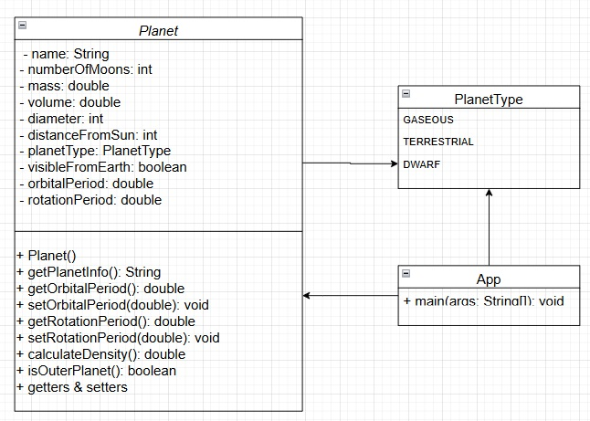

# Solar System Simulation
### Description
A Java project modeling planets in the Solar System with their physical and orbital characteristics. This includes information like mass, volume, number of moons, orbital and rotational periods, and whether a planet is visible from Earth.

### Features

#### Class Planet:

Attributes for planet name, mass, volume, diameter, distance from the Sun, number of moons, planet type, visibility from Earth, orbital period, and rotation period.
Methods for:
Calculating density.
Determining if the planet is an outer planet.
Retrieving detailed planet information.
Enum PlanetType for defining planet types: GASEOUS, TERRESTRIAL, and DWARF.

#### Class App:

Demonstrates the creation and usage of Planet objects.
Displays planet information and performs calculations.
JUnit Tests:
Test methods for verifying the functionality of Planet class (e.g., density calculation and outer planet determination).

#### How to Run
Clone the repository.
Compile the project using any Java IDE or the command line.
Run the App class to see a simulation of planet data.

#### Technologies Used
Java: Core programming language.
JUnit: For unit testing.

## Diagrams

## Authors
Oksana Muzalevska
